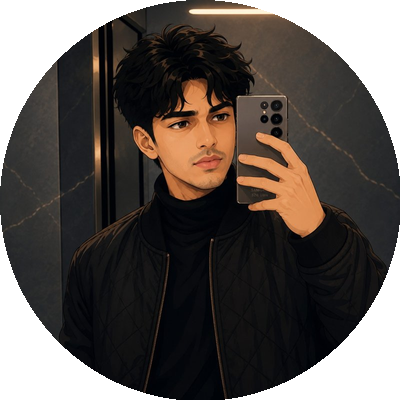

 

 

  

 

## 🚀 About Me

- 👨‍💻 Full-Stack Developer specializing in modern website development, Flutter mobile apps, Telegram bots, Firebase integration, and UI/UX design
- 🎯 Focused on clean architecture, premium user experiences, and scalable digital solutions
- 📚 Currently pursuing higher education — always learning, always building
- ⚡ Fun fact: I turn ideas into fast, secure, visually stunning software

 

## 🛠️ Tech Stack

**Frontend**
 

**Backend**
 

**Database**
 

**Mobile Development**
 

**Tools**
 

 

## 💼 Featured Projects

<table>
<tr>
<td width="50%">

### 🎬 NexFlix Movie Website
 
Premium movie streaming-inspired platform — modern UI, responsive design, cinematic UX.

 

</td>
<td width="50%">

### 📺 NexFlix Live TV & Sports
 
Modern live TV & sports streaming — premium interface, optimized performance.

 

</td>
</tr>
<tr>
<td width="50%">

### 🎨 NexFlix Landing Page
 
Sleek, conversion-focused landing page with smooth animations.

 

</td>
<td width="50%">

### 📱 NexFlix Mobile App
 
Flutter-powered mobile app with Firebase integration and seamless navigation.

 

</td>
</tr>
</table>

 

## 📊 GitHub Stats

> ⚠️ The shared public stats service (`github-readme-stats.vercel.app`) is currently paused by its maintainer, so these two cards may show broken images for now — this isn't something in your README, it's an outage on their end. The permanent fix is deploying your own free copy (30 seconds, no coding):
>
> 
>
> After deploying, copy your new `https://your-project-name.vercel.app` domain and replace `github-readme-stats.vercel.app` in the two image links below with it.

 

## 🐍 Contribution Snake

 

